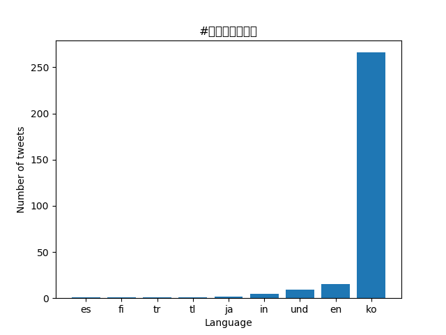

# Coronavirus twitter analysis
For this project I used a technique called mapreduce to extract data from all coronavirus related tweets sent in the year 2020. The images below are charts made using matplotlib library to display the data visually for the hashtags: #coronavirus and #코로나바이러스.

#languages

#country 

