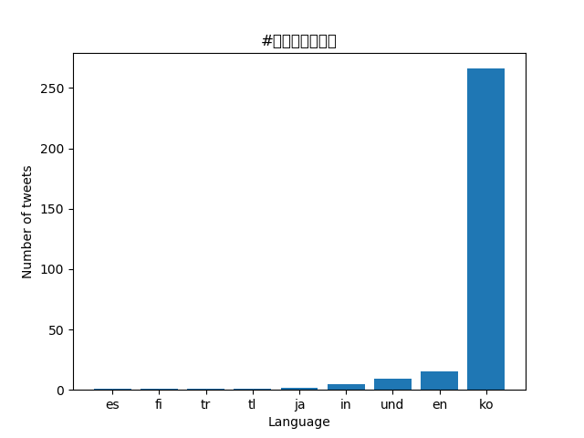
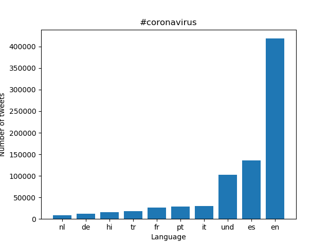
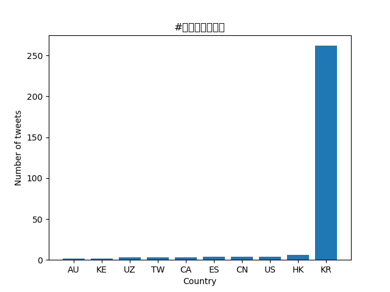

# Coronavirus twitter analysis

For this project I used a technique called mapreduce to extract data from all coronavirus related tweets sent in the year 2020.

## Background

**About the Data:**

Approximately 500 million tweets are sent everyday.
Of those tweets, about 2% are *geotagged*.
That is, the user's device includes location information about where the tweets were sent from.
The lambda server's `/data/Twitter dataset` folder contains all geotagged tweets that were sent in 2020.
In total, there are about 1.1 billion tweets in this dataset.

# Structure of the data
The tweets are stored as follows.
The tweets for each day are stored in a zip file `geoTwitterYY-MM-DD.zip`,
and inside this zip file are 24 text files, one for each hour of the day.
Each text file contains a single tweet per line in JSON format.
JSON is a popular format for storing data that is closely related to python dictionaries.

#How was this done?
The project was split up into 4 tasks

1. Task 1:Map
This task involved making use of a map.py file, which processed a single zip file storing twitter data of an individual day and produces a json file containing that data.

I then had to create a shell script that would first loop through every zip file that contains the year 2020 (representing every day of 2020) in the twitter dataset and then call map.py on the zip file

1. Task 2: Reduce
I then had to make use a reduce.py file that merges all of the output data that was produced by running the shell script

1. Task 3: Vizualize 

I then created a python file that used matplotlib library to display the data visually for the hashtags: #coronavirus and #코로나바이러스, the images below are the charts created. The langauges section displays the language data for every tweet of the year that contains the hashtag '#coronavirus' and another chart for every tweet of year 2020 that contains the hashtag '#코로나바이러스'.

The country section displays the top 10 countries that have the most tweets in the year 2020  that contain the specific hashtag

# languages

# country 

**Learning Objectives:**

1. work with large scale datasets
1. work with multilingual text
1. use the MapReduce divide-and-conquer paradigm to create parallel code
